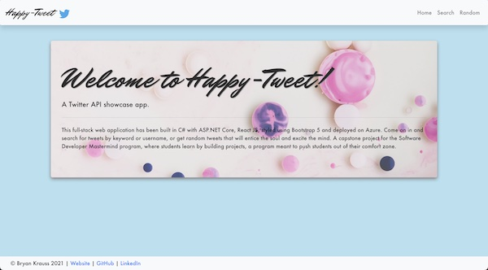

# Happy-Tweet | Twitter Showcase App

### A full stack web application made with React JS, C# with ASP.Net Core, and styled using Bootstrap


### See it [here](https://happy-tweet.azurewebsites.net/)




## Summary


## Installation

To run this application locally you need to add a file called `appsettings.Development.json` in the `API/` directory. The contents of the file should be the following:

```
{
  "Logging": {
    "LogLevel": {
      "Default": "Information",
      "Microsoft": "Warning",
      "Microsoft.Hosting.Lifetime": "Information"
    }
  },
  "Twitter_Key": {
    "BearerToken": "<Insert Twitter Bearer Token Here>"
}
}
```

You can get a Twitter bearer token from `https://developer.twitter.com/`, signing up for a developer account and creating a twitter web application.

You can then go to the `API/Client/` directory and run

```
npm i
```

Move to the `API/` folder and run

```
dotnet watch run
```

to start the application locally.

## Author

Bryan Krauss - Software Developer - [LinkedIn](https://www.linkedin.com/in/bryan-krauss-556b3a200/) | [Website](https://bryankrauss.ca/)